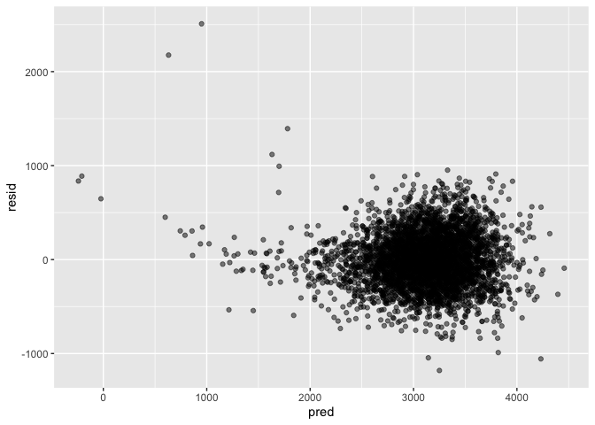
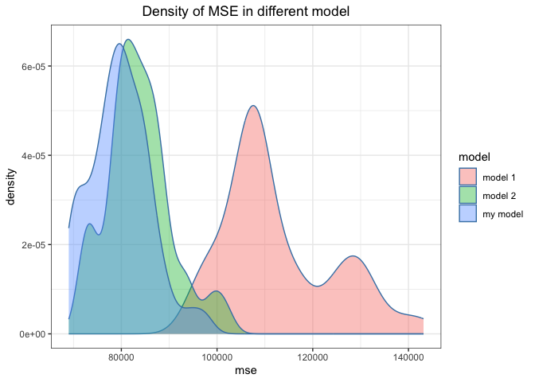

HW6
================
2023-11-18

``` r
library(tidyverse)
```

## Problem 1

Create a city_state variable (e.g. “Baltimore, MD”), and a binary
variable indicating whether the homicide is solved. Omit cities Dallas,
TX; Phoenix, AZ; and Kansas City, MO – these don’t report victim race.
Also omit Tulsa, AL – this is a data entry mistake. For this problem,
limit your analysis those for whom victim_race is white or black. Be
sure that victim_age is numeric.

``` r
omit_location = c("Dallas, TX", "Phoenix, AZ", "Kansas City, MO", "Tulsa, AL")
omit_race = c("White", "Black")

homicide = read_csv("./data/homicide-data.csv") 
homicide = homicide |>
  mutate(city_state = str_c(city, state, sep = ", "),
         resolved = as.numeric(disposition == "Closed by arrest"),
         victim_age = as.numeric(victim_age)) |>
  filter(!city_state %in% omit_location & 
         victim_race %in% omit_race &
         victim_sex != "Unknown") |>
  drop_na(victim_age) |>
  select(resolved, victim_age, victim_race, victim_sex, city_state)
```

For the city of Baltimore, MD, use the glm function to fit a logistic
regression with resolved vs unresolved as the outcome and victim age,
sex and race as predictors. Save the output of glm as an R object; apply
the broom::tidy to this object; and obtain the estimate and confidence
interval of the adjusted odds ratio for solving homicides comparing male
victims to female victims keeping all other variables fixed.

``` r
logit_model = glm(resolved ~ victim_age + victim_sex + victim_race, data = homicide, family = "binomial")
broom::tidy(logit_model, conf.int = T) |>
  mutate(OR = exp(estimate),
         OR.conf.low = exp(conf.low),
         OR.conf.high = exp(conf.high)) |>
  filter(str_detect(term, "sex")) |>
  select(term, OR, OR.conf.low, OR.conf.high) |>
  knitr::kable(digits = 3)
```

| term           |    OR | OR.conf.low | OR.conf.high |
|:---------------|------:|------------:|-------------:|
| victim_sexMale | 0.603 |       0.569 |        0.639 |

Now run glm for each of the cities in your dataset, and extract the
adjusted odds ratio (and CI) for solving homicides comparing male
victims to female victims. Do this within a “tidy” pipeline, making use
of purrr::map, list columns, and unnest as necessary to create a
dataframe with estimated ORs and CIs for each city.

``` r
tidy_stats = function(city, df){
  df |> 
    filter(city_state == city) |>
    glm(resolved ~ victim_age + victim_sex + victim_race, data = _, family = "binomial") |>
    broom::tidy(conf.int = T) |>
    mutate(OR = exp(estimate),
           OR.conf.low = exp(conf.low),
           OR.conf.high = exp(conf.high)) |>
    filter(str_detect(term, "sex")) |>
    select(term, OR, OR.conf.low, OR.conf.high)
}

cities = homicide |> pull(city_state) |> unique()
test_on_city = tibble(
  city = cities,
  hypo = map(cities, tidy_stats, df = homicide)
) |> unnest(hypo) |>
  select(-term)
test_on_city |>
  knitr::kable(digits = 3)
```

| city               |    OR | OR.conf.low | OR.conf.high |
|:-------------------|------:|------------:|-------------:|
| Albuquerque, NM    | 1.767 |       0.825 |        3.762 |
| Atlanta, GA        | 1.000 |       0.680 |        1.458 |
| Baltimore, MD      | 0.426 |       0.324 |        0.558 |
| Baton Rouge, LA    | 0.381 |       0.204 |        0.684 |
| Birmingham, AL     | 0.870 |       0.571 |        1.314 |
| Boston, MA         | 0.667 |       0.351 |        1.260 |
| Buffalo, NY        | 0.521 |       0.288 |        0.936 |
| Charlotte, NC      | 0.884 |       0.551 |        1.391 |
| Chicago, IL        | 0.410 |       0.336 |        0.501 |
| Cincinnati, OH     | 0.400 |       0.231 |        0.667 |
| Columbus, OH       | 0.532 |       0.377 |        0.748 |
| Denver, CO         | 0.479 |       0.233 |        0.962 |
| Detroit, MI        | 0.582 |       0.462 |        0.734 |
| Durham, NC         | 0.812 |       0.382 |        1.658 |
| Fort Worth, TX     | 0.669 |       0.394 |        1.121 |
| Fresno, CA         | 1.335 |       0.567 |        3.048 |
| Houston, TX        | 0.711 |       0.557 |        0.906 |
| Indianapolis, IN   | 0.919 |       0.678 |        1.241 |
| Jacksonville, FL   | 0.720 |       0.536 |        0.965 |
| Las Vegas, NV      | 0.837 |       0.606 |        1.151 |
| Long Beach, CA     | 0.410 |       0.143 |        1.024 |
| Los Angeles, CA    | 0.662 |       0.457 |        0.954 |
| Louisville, KY     | 0.491 |       0.301 |        0.784 |
| Memphis, TN        | 0.723 |       0.526 |        0.984 |
| Miami, FL          | 0.515 |       0.304 |        0.873 |
| Milwaukee, wI      | 0.727 |       0.495 |        1.054 |
| Minneapolis, MN    | 0.947 |       0.476 |        1.881 |
| Nashville, TN      | 1.034 |       0.681 |        1.556 |
| New Orleans, LA    | 0.585 |       0.422 |        0.812 |
| New York, NY       | 0.262 |       0.133 |        0.485 |
| Oakland, CA        | 0.563 |       0.364 |        0.867 |
| Oklahoma City, OK  | 0.974 |       0.623 |        1.520 |
| Omaha, NE          | 0.382 |       0.199 |        0.711 |
| Philadelphia, PA   | 0.496 |       0.376 |        0.650 |
| Pittsburgh, PA     | 0.431 |       0.263 |        0.696 |
| Richmond, VA       | 1.006 |       0.483 |        1.994 |
| San Antonio, TX    | 0.705 |       0.393 |        1.238 |
| Sacramento, CA     | 0.669 |       0.326 |        1.314 |
| Savannah, GA       | 0.867 |       0.419 |        1.780 |
| San Bernardino, CA | 0.500 |       0.166 |        1.462 |
| San Diego, CA      | 0.413 |       0.191 |        0.830 |
| San Francisco, CA  | 0.608 |       0.312 |        1.155 |
| St. Louis, MO      | 0.703 |       0.530 |        0.932 |
| Stockton, CA       | 1.352 |       0.626 |        2.994 |
| Tampa, FL          | 0.808 |       0.340 |        1.860 |
| Tulsa, OK          | 0.976 |       0.609 |        1.544 |
| Washington, DC     | 0.691 |       0.466 |        1.014 |

Create a plot that shows the estimated ORs and CIs for each city.
Organize cities according to estimated OR, and comment on the plot.

``` r
test_on_city |>
  mutate(city = fct_reorder(city, OR)) |>
  ggplot(aes(x = city, y = OR, color = city)) +
  geom_point() +
  geom_errorbar(aes(ymin = OR.conf.low, ymax = OR.conf.high)) +
  theme_bw() +
  labs(x = "city", y = "OR", title = "OR of sex") +
  theme(plot.title = element_text(hjust = 0.5), axis.title.x=element_blank(),
        axis.text.x=element_blank(), axis.ticks.x=element_blank())
```

<!-- -->

## Problem 2

``` r
weather_df = 
  rnoaa::meteo_pull_monitors(
    c("USW00094728"),
    var = c("PRCP", "TMIN", "TMAX"), 
    date_min = "2022-01-01",
    date_max = "2022-12-31") |>
  mutate(
    name = recode(id, USW00094728 = "CentralPark_NY"),
    tmin = tmin / 10,
    tmax = tmax / 10) |>
  select(name, id, everything())
```

The boostrap is helpful when you’d like to perform inference for a
parameter / value / summary that doesn’t have an easy-to-write-down
distribution in the usual repeated sampling framework. We’ll focus on a
simple linear regression with tmax as the response with tmin and prcp as
the predictors, and are interested in the distribution of two quantities
estimated from these data:

``` r
slr = function(df){
  model = lm(tmax ~ tmin + prcp, data = df)
  return(
    tibble(
      residual = broom::glance(model) |> pull(r.squared),
      log_beta1_beta2 = broom::tidy(model, conf.int = T) |> 
        filter(term != "(Intercept)") |>
        pull(estimate) |> prod() |> log()
    )
  )
}
```

r̂ 2 log(β̂ 1∗β̂ 2) Use 5000 bootstrap samples and, for each bootstrap
sample, produce estimates of these two quantities. Plot the distribution
of your estimates, and describe these in words. Using the 5000 bootstrap
estimates, identify the 2.5% and 97.5% quantiles to provide a 95%
confidence interval for r̂ 2 and log(β̂ 0∗β̂ 1) . Note: broom::glance() is
helpful for extracting r̂ 2 from a fitted regression, and broom::tidy()
(with some additional wrangling) should help in computing log(β̂ 1∗β̂ 2).

## Problem 3

Load and clean the data for regression analysis (i.e. convert numeric to
factor where appropriate, check for missing data, etc.).

#### Preprocessing

``` r
birth_weight = read.csv("./data/birthweight.csv") |> tibble()
birth_weight = birth_weight |>
  mutate(babysex = factor(recode(babysex, `1` = "male", `2` = "female")),
         frace = factor(recode(frace, `1` = "white",  `2` = "black", `3` = "asian", `4` = "puerto rican",`8` = "other", `9` = "unknown")),
         mrace = factor(recode(mrace, `1` = "white", `2` = "black", `3` = "asian", `4` = "puerto rican", `8` = "other")),
         malform = factor(recode(malform, `0` = "absent", `1` = "present"))) |>
  select(-pnumlbw, -pnumsga)
```

Data cleaning: - Mutate `babysex`, `frace`, `mrace` and `malform` as
factor because they are categorical variables. - Remove `pnumlbw` and
`pnumsga` because they both only 0 in all values, indicating they are
useless variables.

Propose a regression model for birthweight. This model may be based on a
hypothesized structure for the factors that underly birthweight, on a
data-driven model-building process, or a combination of the two.
Describe your modeling process and show a plot of model residuals
against fitted values – use add_predictions and add_residuals in making
this plot.

#### Variable selection

``` r
# baisc try
mlr = lm(bwt ~ ., data = birth_weight)
mlr |> broom::tidy() |> dim()
```

    ## [1] 23  5

``` r
mlr$rank
```

    ## [1] 22

The rank of MLR model (22) doesn’t equal to the count of predictors (23)
for fitting model, indicating that the variable with `NA` as coefficient
estimate is with colinearity to other variable. So we should discard
this variable because it provide redundant information.

``` r
# variable selection
mlr |> broom::tidy() |>
  filter(p.value < 0.05 & !str_detect(term, "Intercept")) |>
  knitr::kable(digits = 3)
```

| term        | estimate | std.error | statistic | p.value |
|:------------|---------:|----------:|----------:|--------:|
| babysexmale |  -28.707 |     8.465 |    -3.391 |   0.001 |
| bhead       |  130.778 |     3.452 |    37.881 |   0.000 |
| blength     |   74.954 |     2.022 |    37.075 |   0.000 |
| delwt       |    4.101 |     0.395 |    10.386 |   0.000 |
| gaweeks     |   11.549 |     1.465 |     7.882 |   0.000 |
| parity      |   95.541 |    40.479 |     2.360 |   0.018 |
| smoken      |   -4.854 |     0.587 |    -8.269 |   0.000 |

Select variables with significant effect as predictors to fit MLR.
Accroding to the previous result, I select `babysex`, `bhead`,
`blength`, `delwt`, `gaweeks`, `parity`, `smoken` as predictors.

#### Fitting MLR & Plot

``` r
my_mlr = lm(bwt ~ babysex + bhead + blength + delwt + gaweeks + parity + smoken, data = birth_weight)
broom::tidy(my_mlr) |>
  knitr::kable(digits = 3)
```

| term        |  estimate | std.error | statistic | p.value |
|:------------|----------:|----------:|----------:|--------:|
| (Intercept) | -6264.283 |    95.817 |   -65.377 |   0.000 |
| babysexmale |   -29.760 |     8.732 |    -3.408 |   0.001 |
| bhead       |   137.024 |     3.534 |    38.773 |   0.000 |
| blength     |    78.868 |     2.071 |    38.083 |   0.000 |
| delwt       |     2.074 |     0.199 |    10.411 |   0.000 |
| gaweeks     |    14.357 |     1.501 |     9.564 |   0.000 |
| parity      |   102.302 |    41.713 |     2.453 |   0.014 |
| smoken      |    -2.169 |     0.582 |    -3.727 |   0.000 |

``` r
birth_weight |> 
  modelr::add_predictions(my_mlr) |>
  modelr::add_residuals(my_mlr) |>
  select(pred, resid) |>
  ggplot(aes(x = pred, y = resid)) +
  geom_point(alpha = .5)
```

<!-- -->

#### Model comparison with cross validation

Compare your model to two others: One using length at birth and
gestational age as predictors (main effects only) One using head
circumference, length, sex, and all interactions (including the
three-way interaction) between these Make this comparison in terms of
the cross-validated prediction error; use crossv_mc and functions in
purrr as appropriate.

``` r
mse = function(val, pred){ return(mean((val - pred) ^ 2)) }
model_eval = function(train_df, test_df){
  my_mlr = lm(bwt ~ babysex + bhead + blength + delwt + gaweeks + parity + smoken, data = train_df)
  mlr1 = lm(bwt ~ blength + gaweeks, data = train_df)
  mlr2 = lm(bwt ~ bhead * blength * babysex, data = train_df)
  eval_df = test_df |>
    modelr::add_predictions(my_mlr, var = "pred0") |>
    modelr::add_predictions(mlr1, var = "pred1") |>
    modelr::add_predictions(mlr2, var = "pred2")
  return(
    tibble(
      mse0 = mse(eval_df$bwt, eval_df$pred0), 
      mse1 = mse(eval_df$bwt, eval_df$pred1), 
      mse2 = mse(eval_df$bwt, eval_df$pred2)
    )
  )
}
```

``` r
times = 50
mse_df = birth_weight |>
  modelr::crossv_mc(n = times) |>
  mutate(train = map(train, as.tibble), 
         test = map(test, as.tibble), 
         eval_mse = map2(train, test, model_eval)) |>
  unnest(eval_mse) |>
  select(starts_with("mse"))
mse_df 
```

    ## # A tibble: 50 × 3
    ##      mse0    mse1   mse2
    ##     <dbl>   <dbl>  <dbl>
    ##  1 73313. 105338. 79550.
    ##  2 78590. 109716. 82547.
    ##  3 76812. 106365. 79536.
    ##  4 80085. 115095. 85635.
    ##  5 82592. 105258. 83569.
    ##  6 76646. 108908. 80402.
    ##  7 84895. 110351. 87753.
    ##  8 81636. 105656. 84172.
    ##  9 70249.  99271. 72880.
    ## 10 79789. 114548. 84608.
    ## # ℹ 40 more rows

``` r
mse_df |>
  pivot_longer(cols = starts_with("mse"), names_to = "model_slc", values_to = "mse",  names_prefix = "mse") |>
  mutate(model = recode(model_slc, 
                        "0" = "my model", 
                        "1" = "model 1", 
                        "2" = "model 2")) |>
  ggplot(aes(x = mse, fill = model)) +
  geom_density(alpha = .4, adjust = .8, color = "steelblue") +
  labs(
    title = "Density of MSE in different model"
  ) + 
  theme_bw() + 
  theme(plot.title = element_text(hjust = 0.5))
```

<!-- -->
