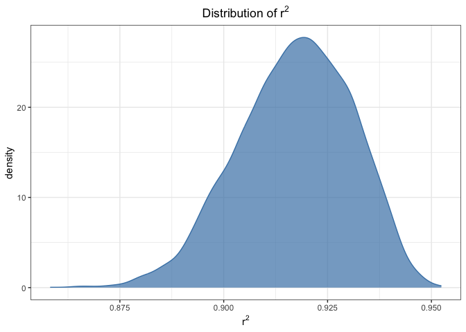
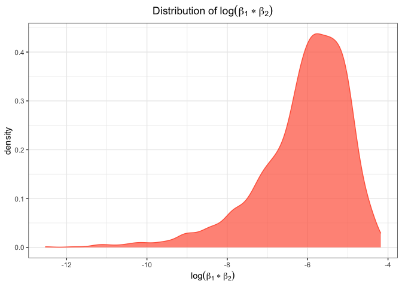

HW6
================
2023-11-29

``` r
library(tidyverse)
library(modelr)
library(latex2exp)
```

## Problem 1

### Data filtering

``` r
omit_location = c("Dallas, TX", "Phoenix, AZ", "Kansas City, MO", "Tulsa, AL")
omit_race = c("White", "Black")

homicide = read_csv("./data/homicide-data.csv") 
homicide = homicide |>
  mutate(city_state = str_c(city, state, sep = ", "),
         resolved = as.numeric(disposition == "Closed by arrest"),
         victim_age = as.numeric(victim_age)) |>
  filter(!city_state %in% omit_location & 
         victim_race %in% omit_race &
         victim_sex != "Unknown") |>
  drop_na(victim_age) |>
  select(resolved, victim_age, victim_race, victim_sex, city_state)
```

### Model fitting

``` r
logit_model = homicide |> 
  filter(city_state == "Baltimore, MD") |>
  glm(resolved ~ victim_age + victim_sex + victim_race, data = _, family = "binomial")
broom::tidy(logit_model, conf.int = T) |>
  mutate(OR = exp(estimate),
         OR.conf.low = exp(conf.low),
         OR.conf.high = exp(conf.high)) |>
  filter(str_detect(term, "sex")) |>
  select(term, OR, OR.conf.low, OR.conf.high) |>
  knitr::kable(digits = 3)
```

| term           |    OR | OR.conf.low | OR.conf.high |
|:---------------|------:|------------:|-------------:|
| victim_sexMale | 0.426 |       0.324 |        0.558 |

``` r
tidy_stats = function(city, df){
  df |> 
    filter(city_state == city) |>
    glm(resolved ~ victim_age + victim_sex + victim_race, data = _, family = "binomial") |>
    broom::tidy(conf.int = T) |>
    mutate(OR = exp(estimate),
           OR.conf.low = exp(conf.low),
           OR.conf.high = exp(conf.high)) |>
    filter(str_detect(term, "sex")) |>
    select(term, OR, OR.conf.low, OR.conf.high)
}

cities = homicide |> pull(city_state) |> unique()
test_on_city = tibble(
  city = cities,
  hypo = map(cities, tidy_stats, df = homicide)
) |> unnest(hypo) |>
  select(-term)
test_on_city |>
  knitr::kable(digits = 3)
```

| city               |    OR | OR.conf.low | OR.conf.high |
|:-------------------|------:|------------:|-------------:|
| Albuquerque, NM    | 1.767 |       0.825 |        3.762 |
| Atlanta, GA        | 1.000 |       0.680 |        1.458 |
| Baltimore, MD      | 0.426 |       0.324 |        0.558 |
| Baton Rouge, LA    | 0.381 |       0.204 |        0.684 |
| Birmingham, AL     | 0.870 |       0.571 |        1.314 |
| Boston, MA         | 0.667 |       0.351 |        1.260 |
| Buffalo, NY        | 0.521 |       0.288 |        0.936 |
| Charlotte, NC      | 0.884 |       0.551 |        1.391 |
| Chicago, IL        | 0.410 |       0.336 |        0.501 |
| Cincinnati, OH     | 0.400 |       0.231 |        0.667 |
| Columbus, OH       | 0.532 |       0.377 |        0.748 |
| Denver, CO         | 0.479 |       0.233 |        0.962 |
| Detroit, MI        | 0.582 |       0.462 |        0.734 |
| Durham, NC         | 0.812 |       0.382 |        1.658 |
| Fort Worth, TX     | 0.669 |       0.394 |        1.121 |
| Fresno, CA         | 1.335 |       0.567 |        3.048 |
| Houston, TX        | 0.711 |       0.557 |        0.906 |
| Indianapolis, IN   | 0.919 |       0.678 |        1.241 |
| Jacksonville, FL   | 0.720 |       0.536 |        0.965 |
| Las Vegas, NV      | 0.837 |       0.606 |        1.151 |
| Long Beach, CA     | 0.410 |       0.143 |        1.024 |
| Los Angeles, CA    | 0.662 |       0.457 |        0.954 |
| Louisville, KY     | 0.491 |       0.301 |        0.784 |
| Memphis, TN        | 0.723 |       0.526 |        0.984 |
| Miami, FL          | 0.515 |       0.304 |        0.873 |
| Milwaukee, wI      | 0.727 |       0.495 |        1.054 |
| Minneapolis, MN    | 0.947 |       0.476 |        1.881 |
| Nashville, TN      | 1.034 |       0.681 |        1.556 |
| New Orleans, LA    | 0.585 |       0.422 |        0.812 |
| New York, NY       | 0.262 |       0.133 |        0.485 |
| Oakland, CA        | 0.563 |       0.364 |        0.867 |
| Oklahoma City, OK  | 0.974 |       0.623 |        1.520 |
| Omaha, NE          | 0.382 |       0.199 |        0.711 |
| Philadelphia, PA   | 0.496 |       0.376 |        0.650 |
| Pittsburgh, PA     | 0.431 |       0.263 |        0.696 |
| Richmond, VA       | 1.006 |       0.483 |        1.994 |
| San Antonio, TX    | 0.705 |       0.393 |        1.238 |
| Sacramento, CA     | 0.669 |       0.326 |        1.314 |
| Savannah, GA       | 0.867 |       0.419 |        1.780 |
| San Bernardino, CA | 0.500 |       0.166 |        1.462 |
| San Diego, CA      | 0.413 |       0.191 |        0.830 |
| San Francisco, CA  | 0.608 |       0.312 |        1.155 |
| St. Louis, MO      | 0.703 |       0.530 |        0.932 |
| Stockton, CA       | 1.352 |       0.626 |        2.994 |
| Tampa, FL          | 0.808 |       0.340 |        1.860 |
| Tulsa, OK          | 0.976 |       0.609 |        1.544 |
| Washington, DC     | 0.691 |       0.466 |        1.014 |

### Plot

Create a plot that shows the estimated ORs and CIs for each city.
Organize cities according to estimated OR, and comment on the plot.

``` r
test_on_city |>
  mutate(city = fct_reorder(city, OR)) |>
  ggplot(aes(x = city, y = OR, color = city)) +
  geom_point() +
  geom_errorbar(aes(ymin = OR.conf.low, ymax = OR.conf.high)) +
  theme_bw() +
  labs(x = "city", y = "OR", title = "OR of sex") +
  theme(plot.title = element_text(hjust = 0.5), axis.title.x=element_blank(),
        axis.text.x=element_blank(), axis.ticks.x=element_blank())
```

<!-- -->

## Problem 2

### Data import

``` r
weather_df = 
  rnoaa::meteo_pull_monitors(
    c("USW00094728"),
    var = c("PRCP", "TMIN", "TMAX"), 
    date_min = "2022-01-01",
    date_max = "2022-12-31") |>
  mutate(
    name = recode(id, USW00094728 = "CentralPark_NY"),
    tmin = tmin / 10,
    tmax = tmax / 10) |>
  select(name, id, everything())
```

### Bootstrapping

``` r
mlr = function(resample){
  df = resample |> as_tibble()
  model = lm(tmax ~ tmin + prcp, data = df)
  return(
    tibble(
      residual_sq = broom::glance(model) |> pull(r.squared),
      log_beta1_beta2 = broom::tidy(model) |> 
        filter(term != "(Intercept)") |>
        pull(estimate) |> prod() |> log()
  ))
  
}

boot_straps = modelr::bootstrap(weather_df, n = 5000) |> 
  mutate(result = map(strap, mlr)) |>
  unnest(result)
```

### Plot

``` r
boot_straps |> ggplot(aes(x = residual_sq)) +
  geom_density(fill = "steelblue", alpha = .7, color = "steelblue") +
  theme_bw() +
  labs(x = TeX("$r^2$"), y = "density", title = TeX("Distribution of $r^2$")) +
  theme(plot.title = element_text(hjust = 0.5))
```

<!-- -->

Description: The distribution of $r^2$ is approximately symmetric. The
mean is around 0.92.

``` r
boot_straps |> ggplot(aes(x = log_beta1_beta2)) +
  geom_density(fill = "tomato", alpha = .7, color = "tomato") +
  theme_bw() +
  labs(x = TeX("$\\log(\\beta_1*\\beta_2)$"), y = "density", title = TeX("Distribution of $\\log(\\beta_1*\\beta_2)$")) +
  theme(plot.title = element_text(hjust = 0.5))
```

<!-- -->

Description: All values are less than 0. The distribution is
left-skewed, which may be caused by the `NA` generated during the
logarithm calculation. The `NA` ratio is 0.6812.

### Quantile for CI

``` r
ci = function(data){
  quantile(data, na.rm = T, probs = c(0.025, 0.975)) |> round(digits = 3)
}
```

The 95% confidence interval for $r^2$ is (0.889, 0.941).

The 95% confidence interval for $\log(\beta_1*\beta_2)$ is (-9.055,
-4.566).

## Problem 3

#### Preprocessing

``` r
birth_weight = read.csv("./data/birthweight.csv") |> tibble()
birth_weight = birth_weight |>
  mutate(babysex = factor(recode(babysex, `1` = "male", `2` = "female")),
         frace = factor(recode(frace, `1` = "white",  `2` = "black", `3` = "asian", `4` = "puerto rican",`8` = "other", `9` = "unknown")),
         mrace = factor(recode(mrace, `1` = "white", `2` = "black", `3` = "asian", `4` = "puerto rican", `8` = "other")),
         malform = factor(recode(malform, `0` = "absent", `1` = "present"))) |>
  select(-pnumlbw, -pnumsga)
```

Data cleaning: - Mutate `babysex`, `frace`, `mrace` and `malform` as
factor because they are categorical variables. - Remove `pnumlbw` and
`pnumsga` because they both only 0 in all values, indicating they are
useless variables.

#### Model description

``` r
# model with full variables
mlr = lm(bwt ~ ., data = birth_weight)
mlr |> summary()
```

    ## 
    ## Call:
    ## lm(formula = bwt ~ ., data = birth_weight)
    ## 
    ## Residuals:
    ##      Min       1Q   Median       3Q      Max 
    ## -1097.68  -184.86    -3.33   173.09  2344.15 
    ## 
    ## Coefficients: (1 not defined because of singularities)
    ##                     Estimate Std. Error t value Pr(>|t|)    
    ## (Intercept)       -6306.8346   659.2640  -9.566  < 2e-16 ***
    ## babysexmale         -28.7073     8.4652  -3.391 0.000702 ***
    ## bhead               130.7781     3.4523  37.881  < 2e-16 ***
    ## blength              74.9536     2.0217  37.075  < 2e-16 ***
    ## delwt                 4.1007     0.3948  10.386  < 2e-16 ***
    ## fincome               0.2898     0.1795   1.614 0.106551    
    ## fraceblack           -6.9048    78.8349  -0.088 0.930210    
    ## fraceother          -16.9392    97.5932  -0.174 0.862212    
    ## fracepuerto rican   -68.2323    78.4692  -0.870 0.384599    
    ## fracewhite          -21.2361    69.2960  -0.306 0.759273    
    ## gaweeks              11.5494     1.4654   7.882 4.06e-15 ***
    ## malformpresent        9.7650    70.6259   0.138 0.890039    
    ## menarche             -3.5508     2.8951  -1.226 0.220083    
    ## mheight               9.7874    10.3116   0.949 0.342588    
    ## momage                0.7593     1.2221   0.621 0.534418    
    ## mraceblack          -60.0488    80.9532  -0.742 0.458266    
    ## mracepuerto rican    34.9079    80.9481   0.431 0.666317    
    ## mracewhite           91.3866    71.9190   1.271 0.203908    
    ## parity               95.5411    40.4793   2.360 0.018307 *  
    ## ppbmi                 4.3538    14.8913   0.292 0.770017    
    ## ppwt                 -3.4716     2.6121  -1.329 0.183913    
    ## smoken               -4.8544     0.5871  -8.269  < 2e-16 ***
    ## wtgain                    NA         NA      NA       NA    
    ## ---
    ## Signif. codes:  0 '***' 0.001 '**' 0.01 '*' 0.05 '.' 0.1 ' ' 1
    ## 
    ## Residual standard error: 272.5 on 4320 degrees of freedom
    ## Multiple R-squared:  0.7183, Adjusted R-squared:  0.717 
    ## F-statistic: 524.6 on 21 and 4320 DF,  p-value: < 2.2e-16

By using all variables for linear regression, I found that `babysex`,
`bhead`, `blength`, `delwt`, `gaweeks`, `parity`, `smoken` are
significant variables and coefficient of `wtgain` variable is fitted as
`NA`(maybe caused by collinearity), while other variables are not
significant.

#### Fitting MLR & Plot

``` r
my_mlr = lm(bwt ~ ., data = birth_weight)
broom::tidy(my_mlr) |>
  knitr::kable(digits = 3)
```

| term              |  estimate | std.error | statistic | p.value |
|:------------------|----------:|----------:|----------:|--------:|
| (Intercept)       | -6306.835 |   659.264 |    -9.566 |   0.000 |
| babysexmale       |   -28.707 |     8.465 |    -3.391 |   0.001 |
| bhead             |   130.778 |     3.452 |    37.881 |   0.000 |
| blength           |    74.954 |     2.022 |    37.075 |   0.000 |
| delwt             |     4.101 |     0.395 |    10.386 |   0.000 |
| fincome           |     0.290 |     0.180 |     1.614 |   0.107 |
| fraceblack        |    -6.905 |    78.835 |    -0.088 |   0.930 |
| fraceother        |   -16.939 |    97.593 |    -0.174 |   0.862 |
| fracepuerto rican |   -68.232 |    78.469 |    -0.870 |   0.385 |
| fracewhite        |   -21.236 |    69.296 |    -0.306 |   0.759 |
| gaweeks           |    11.549 |     1.465 |     7.882 |   0.000 |
| malformpresent    |     9.765 |    70.626 |     0.138 |   0.890 |
| menarche          |    -3.551 |     2.895 |    -1.226 |   0.220 |
| mheight           |     9.787 |    10.312 |     0.949 |   0.343 |
| momage            |     0.759 |     1.222 |     0.621 |   0.534 |
| mraceblack        |   -60.049 |    80.953 |    -0.742 |   0.458 |
| mracepuerto rican |    34.908 |    80.948 |     0.431 |   0.666 |
| mracewhite        |    91.387 |    71.919 |     1.271 |   0.204 |
| parity            |    95.541 |    40.479 |     2.360 |   0.018 |
| ppbmi             |     4.354 |    14.891 |     0.292 |   0.770 |
| ppwt              |    -3.472 |     2.612 |    -1.329 |   0.184 |
| smoken            |    -4.854 |     0.587 |    -8.269 |   0.000 |
| wtgain            |        NA |        NA |        NA |      NA |

``` r
birth_weight |> 
  modelr::add_predictions(my_mlr) |>
  modelr::add_residuals(my_mlr) |>
  select(pred, resid) |>
  ggplot(aes(x = pred, y = resid)) +
  geom_point(alpha = .5) + 
  theme_bw() +
  labs(x = "Fitted value", y = "Residual", title = "Residual-Fitted value") +
  theme(plot.title = element_text(hjust = 0.5))
```

<!-- -->

#### Model comparison with cross validation

Compare model to two others: One using length at birth and gestational
age as predictors (main effects only) One using head circumference,
length, sex, and all interactions (including the three-way interaction)
between these Make this comparison in terms of the cross-validated
prediction error; use crossv_mc and functions in purrr as appropriate.

``` r
model_eval = function(train_df, test_df){
  my_mlr = lm(bwt ~ babysex + bhead + blength + delwt + gaweeks + parity + smoken, data = train_df)
  mlr1 = lm(bwt ~ blength + gaweeks, data = train_df)
  mlr2 = lm(bwt ~ bhead * blength * babysex, data = train_df)
  return(
    tibble(
      rmse0 = rmse(my_mlr, test_df), 
      rmse1 = rmse(mlr1, test_df), 
      rmse2 = rmse(mlr2, test_df)
    )
  )
}
```

``` r
times = 100
rmse_df = birth_weight |>
  modelr::crossv_mc(n = times) |>
  mutate(train = map(train, as.tibble), 
         test = map(test, as.tibble), 
         eval_mse = map2(train, test, model_eval)) |>
  unnest(eval_mse) |>
  select(starts_with("rmse"))
```

``` r
rmse_df |>
  pivot_longer(cols = starts_with("rmse"), names_to = "model_slc", values_to = "rmse",  names_prefix = "rmse") |>
  mutate(model = recode(model_slc, 
                        "0" = "my model", 
                        "1" = "model 1", 
                        "2" = "model 2")) |>
  ggplot(aes(x = rmse, fill = model)) +
  geom_density(alpha = .4, adjust = .8, color = "steelblue") +
  labs(
    title = "Density of RMSE in different model"
  ) + 
  theme_bw() + 
  theme(plot.title = element_text(hjust = 0.5))
```

<!-- -->
